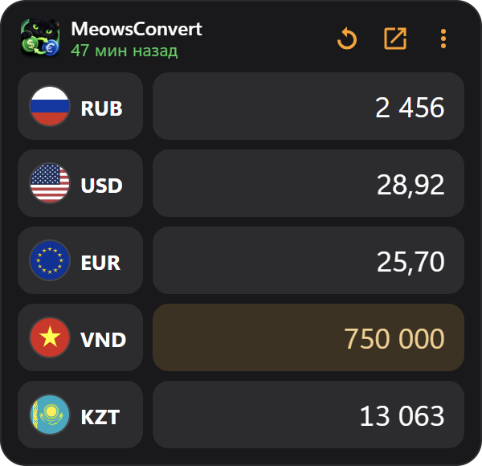
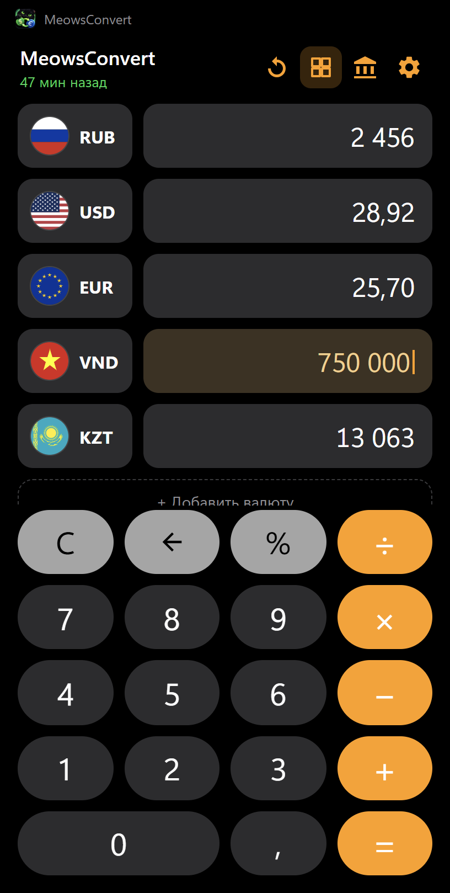

# MeowsConvert

<p align="center">&nbsp;&nbsp;</p>

Конвертер валют для Windows 10/11 с калькулятором и виджетом на рабочий стол.

- Вводите число или выражение (`5000 × 2 + 10%`) в любую валюту, остальные пересчитываются сразу.
- До 12 валют, выбор и порядок в «Мои валюты», замена по клику на флаг.
- Курсы: рыночные (open.er-api.com, 160+ валют) или ЦБ РФ. Последние курсы кешируются и работают без интернета.
- Виджет на рабочем столе: встроен в сам рабочий стол, поэтому не перекрывает программы и не прячется
  при «Свернуть всё» (Win+D, жест тремя пальцами). Перетаскивается за шапку, правый клик открывает меню
  (поверх окон, прозрачность, скрыть).
- Иконка в трее, автозапуск вместе с Windows. Если виджет включён, он появляется при старте.
- Место (и размер) виджета запоминаются относительно монитора: при подключении/отключении экрана, смене масштаба
  или разрешения виджет остаётся на своём мониторе, а не уезжает на соседний.

## Скачать

[Последний релиз](https://github.com/MrMe0ws/MeowsConvert/releases/latest) — Windows 10/11 x64:

- `MeowsConvert Setup X.Y.Z.exe` — установщик (ярлык на рабочем столе, удаление через «Приложения»);
- `MeowsConvert-X.Y.Z-portable.zip` — без установки: распаковать и запустить `MeowsConvert.exe`.

Файлы не подписаны, поэтому SmartScreen может предупредить о неизвестном издателе:
«Подробнее» → «Выполнить в любом случае».

## Запуск

```
npm install
npm start
```

## Сборка установщика

```
npm run dist
```

Установщик появится в `dist/`. Автозапуск лучше включать в установленной версии: в режиме разработки
в автозагрузку попадает путь к `electron.exe` из `node_modules`.

## Клавиши

| Клавиша | Действие |
| --- | --- |
| `0-9`, `,` / `.` | ввод числа |
| `+ - * / %` | операции |
| `Enter` / `=` | посчитать |
| `Backspace` | стереть символ |
| `Esc` / `Delete` | сброс (на других экранах — назад) |
| `↑` `↓` | выбрать валюту |
| `Ctrl+C` / `Ctrl+V` | копировать / вставить сумму |

Настройки и кеш курсов лежат в `%APPDATA%\MeowsConvert`.
